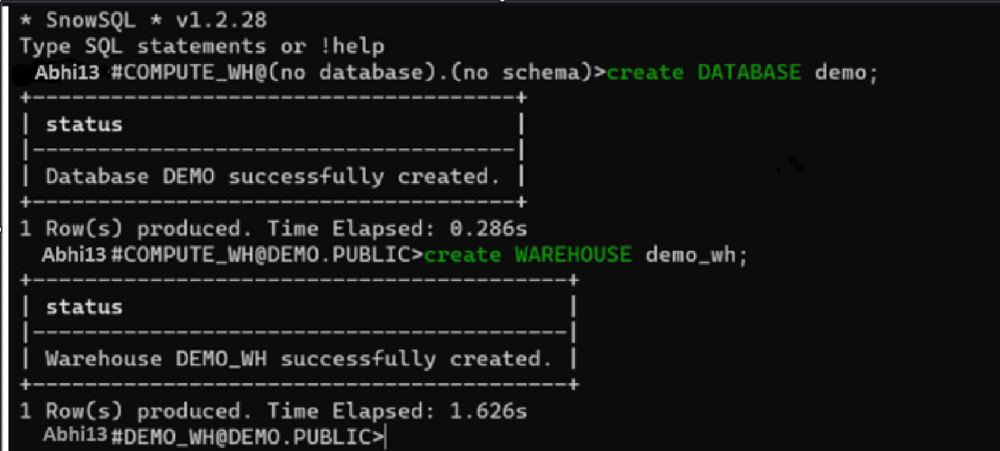
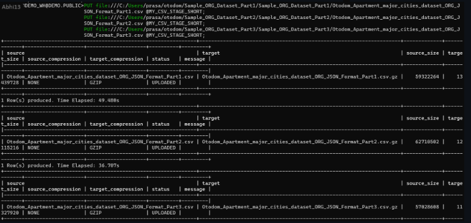

# Housing Insights

In this project, I have focused on providing crucial data insights to aid Ukrainian refugees seeking housing in Poland. Recognizing the immense challenges faced by refugees in finding suitable and affordable accommodation, I leveraged comprehensive data from multiple real estate websites through the Bright Data tool. This endeavor aimed to simplify and optimize the property search process for displaced individuals and families, ensuring they have access to reliable and up-to-date information about the housing market in Poland.

My first step involved scraping extensive datasets from various real estate websites using Bright Data. This tool enabled me to compile a rich and diverse collection of property listings, encompassing different regions, types of accommodation, price ranges, and availability. By aggregating data from multiple sources, I ensured a more holistic and accurate representation of the housing market, which is essential for making informed decisions.

Once the data was collected, I loaded it into the Snowflake database. Snowflake's powerful cloud-based architecture allowed me to manage large volumes of data efficiently and perform complex queries with ease. The platform's scalability and performance were crucial in handling the intricate data transformations and analyses required for this project.

In the Snowflake database, I undertook a meticulous process of data cleaning and transformation. This involved identifying and rectifying inconsistencies, removing duplicates, and standardizing the information across various listings. Ensuring data quality was paramount to provide accurate and reliable insights to the users. I also enriched the data with additional attributes such as proximity to essential services (schools, hospitals, public transport), neighborhood safety ratings, and community amenities, which are particularly important for refugees adjusting to a new country.

After preparing the data, I conducted thorough analyses to extract meaningful insights. I focused on key parameters that would be most beneficial for Ukrainian refugees, such as average rental prices, availability of different types of accommodation (apartments, houses, shared housing), and trends in various regions of Poland. This analysis helped in identifying affordable housing options, understanding market dynamics, and spotting emerging trends that could impact the availability and pricing of properties.

The final stage of the project involved building comprehensive reports to answer some of the most common questions related to the property market in Poland. I designed interactive dashboards and visualizations that allowed users to explore data intuitively and derive actionable insights. These reports provided a detailed overview of the housing market, highlighting the best regions for affordable housing, trends in rental and sale prices, and availability of different property types.

Additionally, I created customized reports focusing on specific needs of Ukrainian refugees, such as family-friendly neighborhoods, proximity to Ukrainian communities, and access to support services. These tailored insights aimed to make the relocation process smoother and more informed, helping refugees find homes that best meet their needs and preferences.

Overall, this project combined the power of data aggregation, advanced analytics, and user-centric reporting to support Ukrainian refugees in their search for housing in Poland. By providing accurate, comprehensive, and actionable insights, I aimed to ease the transition for refugees and contribute to their successful integration into the Polish community..<br>
 # Major steps involved
 Scraping the data, Loading the data and Flattening the data using SQL.<br>
Analyzing, Cleaning and Building reports.<br>
 # Scraping the Data<br>
Using the Bright Data tool, I got the data file downloaded on our local machine and then loaded the data into the Snowflake database.<br>
As the data was in json format.<br>
Using the snowsql, I successfully logged in through the terminal.<br>
First step was to create the DataBase, created the database<br>
Also created the Warehouse as shown in below image.<br>
One who will allocate the resources for every computation, When you run query any operations some resources will be 

<br>

Created STAGE to store the data files. As the data files are in csv format, I need to create the file format first, which is csv_format.<br>
```sql
CREATE OR REPLACE FILE FORMAT CSV_FORMAT
  type = csv
  field_delimiter = ','
  field_optionally_enclosed_by='"';
```
```sql
CREATE OR REPLACE STAGE MY_CSV_STAGE_SHORT
  file_format=csv_format;
```
Once the stage is created I loaded csv file data to internal stage using PUT command which can be only be run from SNOWSQL<br>

<br>

I slected the warehouse which was created and also the database:<br>
 <br>

<br>

Created the destination table where will copy all the data in table from stage.<br>
```sql
CREATE or replace TABLE OTODOM_DATA_DUMP_SHORT
(
    json_data  text
);
```

I Loaded data from stage to table in snowflake:
```sql
COPY INTO OTODOM_DATA_DUMP_SHORT
FROM @MY_CSV_STAGE_SHORT;
```

To verify the data I checked the count:
```sql
SELECT COUNT(1) FROM OTODOM_DATA_DUMP_SHORT; --  62816 records.
```
# Flatten the data and load to a new table<br>

As the data was in json format semi structured format I need to move the data in different columns.<br>
In this step I created the new table otodom_data_short_flatten which will hold the flatten data. Also added the one identifier column called rn<br>
I used PARSE_JSON function to parse the JSON data in this field.<br>
As in the description there are few html tags so I used the regexp to remove that and in other I have just removed the “ and replaced it with blanks and also the caret and made datatype as string(json_data is the name) 

```sql
CREATE OR REPLACE table otodom_data_short_flatten
as
select row_number() over(order by title) as rn
, x.*
from (
select replace(parse_json(json_data):advertiser_type,'"')::string as advertiser_type
, replace(parse_json(json_data):balcony_garden_terrace,'"')::string as balcony_garden_terrace
, regexp_replace(replace(parse_json(json_data):description,'"'), '<[^>]+>')::string as description
, replace(parse_json(json_data):heating,'"')::string as heating
, replace(parse_json(json_data):is_for_sale,'"')::string as is_for_sale
, replace(parse_json(json_data):lighting,'"')::string as lighting
, replace(parse_json(json_data):location,'"')::string as location
, replace(parse_json(json_data):price,'"')::string as price
, replace(parse_json(json_data):remote_support,'"')::string as remote_support
, replace(parse_json(json_data):rent_sale,'"')::string as rent_sale
, replace(parse_json(json_data):surface,'"')::string as surface
, replace(parse_json(json_data):timestamp,'"')::date as timestamp
, replace(parse_json(json_data):title,'"')::string as title
, replace(parse_json(json_data):url,'"')::string as url
, replace(parse_json(json_data):form_of_property,'"')::string as form_of_property
, replace(parse_json(json_data):no_of_rooms,'"')::string as no_of_rooms
, replace(parse_json(json_data):parking_space,'"')::string as parking_space
from OTODOM_DATA_DUMP_SHORT 

) x;
```
Before data which was in json formart.<br>
```sql
select * from OTODOM_DATA_DUMP_SHORT limit 10;
```
<br>

After Flattening the data I got seperate columns.<br>
```sql
select * from otodom_data_short_flatten limit 50;
```
<br>

Now I have crated the different stages to load the address table and title which is in English<br>
Once its loaded I have copied the data into the tables.<br>
I have loaded both files using PUT command<br>
```sql
CREATE OR REPLACE FILE FORMAT CSV_FORMAT
  type = csv
  field_delimiter = ','
  field_optionally_enclosed_by='"';

create or replace stage my_csv_stage
file_format=CSV_FORMAT;

create or replace stage my_csv_stage_trans
file_format=CSV_FORMAT;
```


```sql
create table otodom_data_flatten_address_full(
rn int,
location text,
address text
);

create table otodom_data_flatten_trans_full(
rn int,
title text,
title_en text
);

copy into otodom_data_flatten_trans_full from
@my_csv_stage_trans;

copy into otodom_data_flatten_address_full from
 @my_csv_stage;
```

I have transformed the data to single table.<br>
The code below creates a new table named OTODOM_DATA_TRANSFORMED through data transformation. It processes existing property data, converts prices and surface areas, extracts address elements, and translates titles. Additionally, it determines property types based on conditions like price and surface. Finally, it generates an apartment_flag column that categorizes properties.
```sql
CREATE OR REPLACE TABLE OTODOM_DATA_TRANSFORMED
as
with cte as (select ot.*, case when price like 'PLN%' then try_to_number(replace(price,'PLN ',''),'999,999,999.99') 
when price like '€%' then try_to_number(replace(price,'€',''),'999,999,999.99') * 4.43 end as price_new, try_to_double(replace(replace(replace(replace(surface,'m²',''),'м²',''),' ',''),',','.'),'9999.99') as surface_new, replace(parse_json(addr.address):suburb,'"', '') as suburb, replace(parse_json(addr.address):city,'"', '') as city, replace(parse_json(addr.address):country,'"', '') as country, trans.title_en as title_eng from otodom_data_short_flatten ot left join otodom_data_flatten_address_full addr on ot.rn=addr.rn left join otodom_data_flatten_trans_full trans on ot.rn=trans.rn) select *, case when lower(title_eng) like '%commercial%' or lower(title_eng) like '%office%' or lower(title_eng) like '%shop%' then 'non apartment' when is_for_sale = 'false' and surface_new <=330 and price_new <=55000 then 'apartment' when is_for_sale = 'false' then 'non apartment' when is_for_sale = 'true' and surface_new <=600 and price_new <=20000000 then 'apartment' when is_for_sale = 'true'  then 'non apartment' end as apartment_flag
from cte;
```


 


